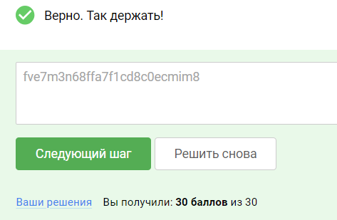

### Практика «Разведка в сети и компрометация Windows-машин»

Подготовка
Требования к лабораторному стенду:

На вашей операционной системе должно быть установлено программное обеспечение VirtualBox

Поддерживаемые ОС: Linux,Windows, MacOS (x64). MacOS с архитектурой arm (m1/m2/…) не поддерживаются.

Для подготовки стенда:

Необходимо скачать архив по ссылке: Windows7.v2.7z (Зеркало: Windows7.v2.7z Яндекс.Диск)

Распаковать данный архив и перейти в появившуюся директорию Windows7. Далее импортировать виртуальную машину Windows7
двойным нажатием на файл Windows7.vbox.

После импорта виртуальной машины, запустить ее и войти под пользователем Alex с паролем HappyHacking, для инициализации
сети ОС.

ОС Windows попросит вас настроить сетевое размещение и предложит выбрать из трех вариантов:

    Домашняя сеть
    Сеть предприятия
    Общественная сеть
    Единственный вариант, который вы можете выбрать - Общественная сеть.

Возможные проблемы:

1. Так как данный виртуальный стенд является виртуальной машиной на основе Windows7 ОС, операционная система Windows
   может испытывать трудности с получением сетевого адреса в вашей локальной сети. Убедитесь что в настройках
   виртуальной машины вы используете опцию “Bridged Adapter”, чтобы ваша виртуальная машина получила адрес в вашей
   физической сети.

2. Чтобы машина Windows получила IP адрес в сети, необходимо после запуска машины зайти в нее под каким либо
   пользователем. Для каждой машины вам предоставлен пользователь для входа в нее, с целью инициализации сети. В данной
   виртуальной машине вам нужно использовать аккаунт:

Логин: Alex
Пароль: HappyHacking

### Задание

Проанализируйте защищенность узла, развернутого вами в виртуальном стенде, определите версию ПО и попытайтесь определить
известные уязвимости данной операционной системы. Обнаружьте известную уязвимость, которой подвержена данная
операционная система и проэксплуатируйте ее при помощи фреймворка metasploit.

В качестве подтверждения успешной эксплуатации предоставьте флаг (секретную строку в формате 26 букв и цифр) из файла
root.txt, расположенного в папке рабочего стола пользователя Kevin.

