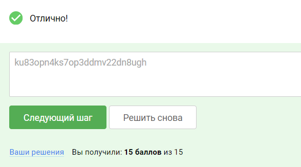
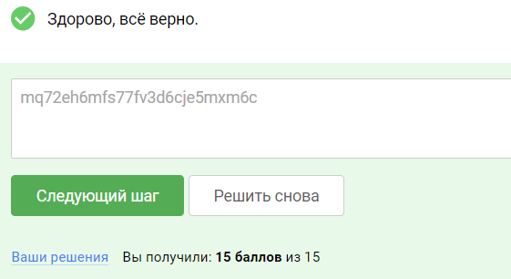

### Практика «Повышение привилегий на узлах локальной сети Windows»

Подготовка
Требования к лабораторному стенду:

На вашей операционной системе должно быть установлено программное обеспечение VirtualBox.
Поддерживаемые ОС: Linux,Windows, MacOS (x64). MacOS с архитектурой arm (m1/m2/…) не поддерживаются.

Для подготовки стенда:

Необходимо скачать архив по ссылке: Win10.rar (Зеркало: Win10.rar Яндекс.Диск)

Распаковать данный архив и перейти в появившуюся директорию Win10. Далее импортировать виртуальную машину Windows10
двойным нажатием на файл Win10.vbox.

После запуска машины, чтобы она инициализировала сеть необходимо войти в нее под специальным аккаунтом:

      Логин: helpdesk
      Пароль: Qwerty123

Возможные проблемы:

1. Так как виртуальная машина была экспортирована с другого компьютера, в ее настройках осталось указание ранее
   использованного интерфейса для беспроводной сети. В связи с этим может произойти ошибка:

…the following physical network interfaces were not found: Intel(R) Wi-Fi 6E…

Если данная ошибка появилась, то просто измените адаптер сети на используемый вами в настройках машины. В предложенном
окне ошибки, может появиться кнопка Change Network Settings. Нажмите на нее и поменяйте имея адаптера на ваш в
открывшемся окне настроек сети машины.

2. Так как данный виртуальный стенд является виртуальной машиной на основе Windows 10 ОС, операционная система Windows
   может испытывать трудности с получением сетевого адреса в вашей локальной сети. Убедитесь что в настройках
   виртуальной машины вы используете опцию “Bridged Adapter”, чтобы ваша виртуальная машина получила адрес в вашей
   физической сети.

    3. Чтобы машина Windows получила IP адрес в сети, необходимо после запуска машины зайти в нее под каким либо
       пользователем. Для каждой машины вам предоставлен пользователь для входа в нее, с целью инициализации сети. В
       данной
       виртуальной машине вам нужно использовать аккаунт:

             Логин: helpdesk
             Пароль: Qwerty123

### Задание 1

Вам известно, что узел, который развернут вами в качестве лабораторного стенда, принадлежит пользователю по имени john.

Проанализируйте защищенность узла. Воспользуйтесь опубликованным на узле SSH сервисом, чтобы подобрать пароль
пользователя John с использование словаря rockyou.

В качестве подтверждения успешной эксплуатации предоставьте флаг (секретная строка в формате 26 букв и цифр) из файла
user.txt, расположенного в папке рабочего стола пользователя John.

