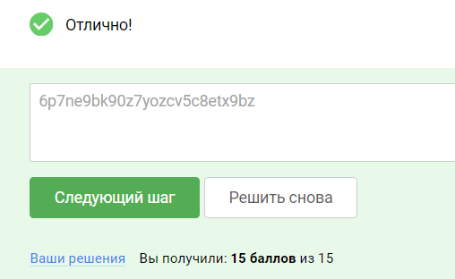

### Подготовка

Требования к лабораторному стенду:

На вашей операционной системе должно быть установлено программное обеспечение VirtualBox

Поддерживаемые ОС: Linux,Windows, MacOS (x64). MacOS с архитектурой arm (m1/m2/…) не поддерживаются.

Для подготовки стенда:

Необходимо скачать архив по ссылке: WinServer2016 for VBox.rar (Зеркало: WinServer2016.rar Яндекс.Диск)

Распаковать данный архив и перейти в появившуюся директорию WinServer2016. Далее импортировать виртуальную машину
Windows Server 2016 двойным нажатием на файл WinServer2016.vbox.

Возможные проблемы:

1. Так как данный виртуальный стенд является виртуальной машиной на основе Windows Server 2016 ОС, операционная система
   Windows может испытывать трудности с получением сетевого адреса в вашей локальной сети. Убедитесь что в настройках
   виртуальной машины вы используете опцию “Bridged Adapter”, чтобы ваша виртуальная машина получила адрес в вашей
   физической сети.

2. Чтобы машина Windows получила IP адрес в сети, необходимо после запуска машины зайти в нее под каким либо
   пользователем. Для каждой машины вам предоставлен пользователь для входа в нее, с целью инициализации сети. В данной
   виртуальной машине вам нужно использовать аккаунт:

Логин: master
Пароль: Qwerty123

### Задание 1

Проанализируйте защищенность узла, развернутого вами в виртуальном стенде, определите версию ПО и попытайтесь определить
известные уязвимости данной операционной системы. Обнаружьте известную уязвимость, которой подвержена данная
операционная система и проэксплуатируйте ее при помощи фреймворка metasploit.

В качестве подтверждения успешной эксплуатации предоставьте флаг (секретную строку в формате 26 букв и цифр) из файла
root.txt, расположенного в папке рабочего стола пользователя Administrator.

### Задание 2

Соберите информацию о домене при помощи утилит ldapdomaindump или BloodHound и найдите в домене пользователя, у которого
в комментарии указан секретный флаг в формате: Flag{ПРОИЗВОЛЬНЫЕ ЦИФРЫ И БУКВЫ}.

В качестве ответа предоставьте всю строку флага в формате Flag{ПРОИЗВОЛЬНЫЕ ЦИФРЫ И БУКВЫ}.

