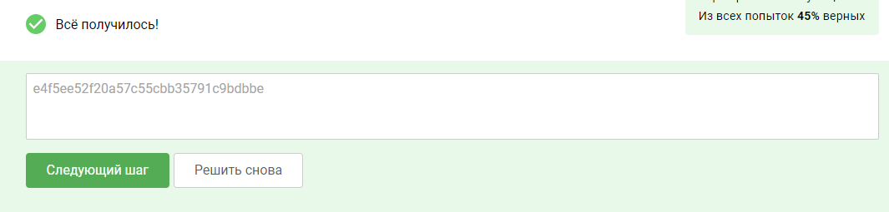

### Практика «Поиск ресурсов организации»
Задание


Вы точно знаете, что основной домен организации cyber-ed.ru. Ваша задача постараться найти как можно больше поддоменов,
связанных с этой организацией.

Некоторые поддомены в TXT-записи DNS-сервера содержат различные флаги. В одном из поддоменов (кстати, его имя будет
логически связано с заданием) будет TXT-запись с флагом в формате: FLAG=значение_флага, где "значение_флага" — это смесь
из 32 произвольных букв и цифр. Вам необходимо найти этот флаг и предоставить его значение в текстовое поле ниже.

Если не получается самостоятельно выполнить задание, то в следующем шаге можно подсмотреть подсказки. Для максимального
эффекта от изучения материала рекомендуется не читать все подсказки разом, а пытаться самостоятельно найти решение
задачи.

```commandline
host -t txt task.cyber-ed.ru

Ответ:
e4f5ee52f20a57c55cbb35791c9bdbbe
```

