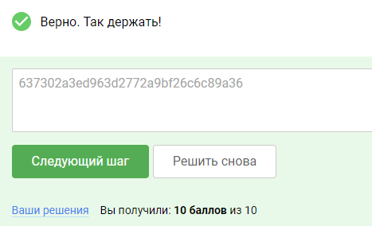

### Практика «Уязвимости обхода аутентификации»
Подготовка
#### Требования к лабораторному стенду:

На вашей операционной системе должно быть установлено программное обеспечение docker и docker-compose.

Поддерживаемые ОС: Linux,Windows, MacOS (x64/arm).

Для подготовки стенда:

Необходимо скачать архив по ссылке: courses-shop.zip (Зеркало: courses-shop.zip Яндекс.Диск)

Распаковать данный архив и перейти в появившуюся директорию courses-shop-prod в терминальной оболочке вашей ОС.
Выполнить команду (при запущенном сервисе docker):

docker-compose up -d

По адресу http://localhost:1337 появится приложение лабораторного стенда.

Возможные проблемы:

1. На некоторых компьютерах приложение может долго ожидать подключения к базе данных. Это зависит от мощностей вашего
   компьютера.

2. По той же причине бот (администратор приложения) может не запуститься, если база данных запускалась дольше 15 секунд.
   В таком случае вы можете перезагрузить сервис бота из папки приложения после загрузки базы данных командой:
   docker-compose restart bot

Необходимо находиться в директории приложения, в одном месте с файлом docker-compose.yml.

### Решение

#### Подготовка

Чтобы установить Docker и Docker Compose на Kali Linux, следуйте этим шагам:

**Установка Docker:**

1. Откройте терминал и выполните следующие команды:

```commandline
sudo apt-get update
sudo apt-get install docker.io
```

2. После установки Docker выполните команду, чтобы запустить службу Docker.

```commandline
sudo systemctl start docker
```

а эта команда покажет вам текущий статус докер (active - должен быть):

```commandline
sudo systemctl status docker
```

выйти ctrl+C

3. Выйдите из текущей сессии и войдите снова, чтобы изменения в группах применились.

#### **Установка Docker Compose:**

1. В терминале выполните следующие команды:

```commandline
sudo apt-get install curl
```

2. Затем выполните команду для загрузки последней версии Docker Compose:

```commandline
sudo curl -L "https://github.com/docker/compose/releases/latest/download/docker-compose-$(uname -s)-$(uname -m)" -o
/usr/local/bin/docker-compose
```

3. Дайте права на выполнение команды docker-compose:

```commandline
sudo chmod +x /usr/local/bin/docker-compose
```

4. Убедитесь, что Docker Compose установлен и работает правильно, выполните команду, чтобы
   проверить версию.

```commandline
docker-compose --version
```

Теперь Docker и Docker Compose должны быть установлены и готовы к использованию на Kali Linux. Вы можете проверить
установку, выполнив команды docker version и docker-compose --version, чтобы убедиться, что они успешно запускаются без
ошибок.

Скачиваем архив с докер образом:
https://cybered-my.sharepoint.com/:u:/g/personal/v_karmanov_cyber-ed_ru/EfbBb1QSvkNNnLfsmo_Ew44BwU3Kgz_N6kpnrIUN56IulQ?e=Qe6hVZ

Распаковывыем архив, получим папку с файлами courses-shop-prod перейдем в нее через консоль в моем случае это адрес
/home/kali/Downloads/courses-shop-prod (в вашем случае будет иной адрес, будьте внимательны) в командной строке:

```commandline
cd /home/kali/Downloads/courses-shop-prod
```

Выполнить команду (при запущенном сервисе docker):

```commandline
sudo docker-compose up -d

Если все успешно соралось, то последними строками будут:

Network courses-shop-prod-default Created
Container courses-shop-prod-app-1 Started
Container courses-shop-prod-db-1 Started
Container courses-shop-prod-bot-1 Started
```

После подготовки и запуска образа открываем браузер и вводим http://localhost:1337 появится страница с продажей софта
Pricing, не пугайтесь это и есть наш стенд

Далее копируем архив репозитория автора со страницы гитхаба по ссылке https://github.com/empty-jack/YAWR/tree/master
распаковываем архив

#### 1. Исследуем веб-приложение на предмет наличия в нем прочих файлов и разделов (этот шаг в лабе не обязателен т.к. страница логирования, она же админка уже найдена в курсе)

Рассмотрим использование утилиты ffuf, используемой для обнаружения существующих путей до файлов и директорий на
веб-сервере, в кали линукс она уже установлена по умолчанию.

Для ведения перебора понадобится словарь путей, который есть в нашем архиве из гитхаба:
YAWR/blob/master/Web/files_and_directories/fuzz.txt

Укажем утилите следующие ключи:

-w – путь до файла со словарем;
-u – целевой URL, в который необходимо поместить слово FUZZ для указания места для вставки паттернов из словаря,
-fc – фильтрация кодов HTTP-ответов.

Обязательно поменяйте путь на свой, где находится файл fuzz.txt у меня этот путь
/home/kali/Downloads/YAWR-master/Web/files_and_directories/fuzz.txt

```commandline
ffuf -w /home/kali/Downloads/YAWR-master/Web/files_and_directories/fuzz.txt -u http://localhost:1337/FUZZ -fc 403
```

найдем ту же страницу admin что и автор, этот шаг можно было и не выполнять, только логин admin и пароль admin в лабе
уже не будут работать, для этого переходим к шагу 2

#### 2. Попробуем выявить уязвимости в механизме аутентификации.

#### **Burp Suite установка если его нет в системе**

Burp Suite это один из наиболее популярных инструментов для тестирования на проникновение (penetration testing)
веб-приложений. Чтобы установить и запустить Burp Suite на Kali Linux, следуйте этим шагам:

1. Посетите официальный сайт PortSwigger (разработчика Burp Suite) по
   адресу https://portswigger.net/burp/communitydownload и нужно только ввести адрес своей почты для загрузки Burp Suite
   Community Edition.

2. После загрузки Burp Suite, откройте терминал и перейдите в каталог скачанного файла.

```commandline
cd /home/kali/Downloads
```

сам файл burpsuite_community_linux_v2023_10_3_4.sh является исполняемым, но для того что бы он заработал нужно сначала
указать нашей системе разрешение на его исполнение:

```commandline
sudo chmod +x burpsuite_community_linux_v2023_10_3_4.sh
```

а затем запустить установку при помощи команды:

```commandline
sudo ./burpsuite_community_linux_v2023_10_3_4.sh
```

далее запустится в графическом режиме установщик, выполняем все по умолчанию.

3. Запустите Burp Suite, выполните команду:
```commandline
sudo burpsuite
```   

4. Burp Suite будет запущен и откроется его графический интерфейс. Вы можете начать использовать инструмент для
   сканирования и тестирования веб-приложений.
- next (нам достаточно и временного проекта по этому на странице temporary project жмем далее)
- Start Burp (используем настройки по умолчанию Use Burp defaults)
- выбираем вкладку proxy
- на вкладке жмем Open Browser
#### **Burp Suite работа**

Попробуем зайти в интерфейс панели в браузере, используя логин admin и любой пароль, например 12345, это нужно для
дальнейшего анализа запроса в
BurpSuite:

- пароль найдент и это - q1w2e3r4
- otp будет меняться каждый раз в моем случае был - 427

после подключения админки, нажимаем CTRL+U 
в конце страницы вы увидите: <!-- 637302a3ed963d2772a9bf26c6c89a36 -->
тут то и спрятался наш код




