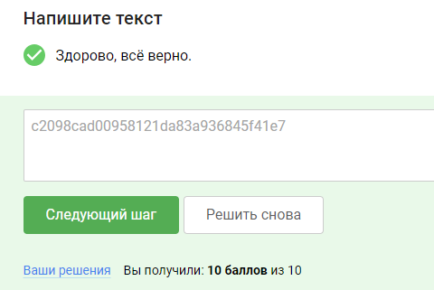

### 5.3 Уязвимости инъекции команд ОС

Инъекция команд ОС (также известная как shell инъекция) является уязвимостью веб-приложений, которая позволяет
злоумышленнику выполнять произвольные команды операционной системы (ОС) на сервере, на котором запущено приложение, и,
как правило, дает возможность полностью скомпрометировать приложение и все его данные. Очень часто злоумышленник может
использовать уязвимость внедрения команд ОС для компрометации других частей инфраструктуры, используя доверительные
отношения для перенаправления атаки на другие системы в организации.

#### Как возникают уязвимости инъекции команд?
Пример допущенной уязвимости инъекции команд:
```commandline
$command = 'convert -pointsize 72 label:Hello ' . $_FILES['userfile']['name'];
system($command);
```

В примере выше имя файла попадает прямо в строку исполнения, которая в последствии будет выполнена терминальной
оболочкой. Это позволяет дописать дополнительные команды терминальной оболочки и воспользоваться этим недостатком.

Пример эксплуатации для уязвимости выше:

------WebKitFormBoundaryePkpFF7tjBAqx29L
Content-Disposition: form-data; name="userfile"; filename="check | ls -la;"
Content-Type: application/x-object

... contents of file goes here ...
Зачастую эксплуатация подобного рода уязвимостей затруднена и требует поиска возможностей выполнения кода через другие
“контексты” и технологии.

Например, выполнение команд возможно в ряде других уязвимостей, которые, прежде чем получить возможность выполнить
произвольную команду, надо найти и проэксплуатировать.

К подобным уязвимостям относятся:
- Уязвимости небезопасной десериализации
- Уязвимости внедрения шаблонов на стороне сервера SSTI
- Уязвимости SQL инъекции
- Уязвимости переполнения буфера / кучи / стека
- Множественные случаи проблем и ошибок реализации, возникающих при работе с запуском процессов и работе с терминальной
оболочкой



