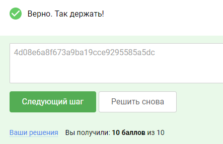

### 5.4 Уязвимости контроля доступа

Что такое контроль доступа?

В контексте веб-приложений контроль доступа зависит от аутентификации и управления сеансами:

- Аутентификация идентифицирует пользователя и подтверждает, что он является тем, за кого себя выдает.
- Управление сеансом идентифицирует, какие последующие HTTP-запросы выполняются тем же самым пользователем.
- Управление доступом определяет, разрешено ли пользователю выполнять действия, которые он пытается выполнить.

Сломанный контроль доступа является часто встречающейся и часто критической уязвимостью безопасности. Проектирование и
управление контролем доступа — это сложная и динамичная проблема, которая применяет деловые, организационные и правовые
ограничения к технической реализации. Проектные решения по контролю доступа должны приниматься людьми, а не
технологиями, и вероятность ошибок высока.

### Категории контроля доступа

С точки зрения пользователя, контроль доступа можно разделить на следующие категории:

- Вертикальный контроль доступа.
- Горизонтальный контроль доступа.
- Контекстно-зависимый контроль доступа.

#### Вертикальный контроль доступа

Вертикальный контроль доступа — это механизмы, ограничивающие доступ к чувствительным функциям, недоступным другим типам
пользователей. С помощью вертикальных средств контроля доступа различные типы пользователей имеют доступ к различным
функциям приложений. Например, администратор может изменить или удалить учетную запись любого пользователя, в то время
как обычный пользователь не имеет доступа к этим действиям. Вертикальные средства контроля доступа могут быть более
тонкой реализацией моделей безопасности, разработанных для внедрения бизнес-политик, таких, как разделение обязанностей
и наименьших привилегий.

#### Пример уязвимостей IFLAC

Insecure Function Level Access Control (IFLAC) — это подкатегория уязвимостей контроля доступа. Уязвимый контроль
доступа функционального уровня может позволить злоумышленникам получить доступ к несанкционированным для роли
злоумышленника функциям. Административные функции являются основной целью данного типа атак.

Данная уязвимость возникает, когда приложение публикует функциональный интерфейс (например, API), в котором не
проверяется уровень доступа для обращения к определенным в интерфейсе функциям. В таком случае злоумышленник может
вызывать функции приложения, которые дают ему привилегии, не задуманные для использования уровнем роли злоумышленника.

Примером может послужить возможность обращения к вызову функции удаления пользователя, в то время как доступ в
административную панель для низкопривилегированного пользователя формально закрыт. Т.е. пользователь не может открыть
кабинет администратора, но может выполнить запрос к методу API, который будет успешно выполнен.

#### Горизонтальный контроль доступа

Горизонтальный контроль доступа — это механизмы, ограничивающие доступ к ресурсам для пользователей, которым специально
разрешен доступ к этим ресурсам.

С помощью горизонтального контроля доступа различные пользователи имеют доступ к подмножеству ресурсов одного и того же
типа. Например, банковское приложение позволит пользователю просматривать транзакции и осуществлять платежи со своих
счетов, но не со счетов любого другого пользователя.

Пример уязвимостей IDOR
Небезопасные прямые ссылки на объекты (IDOR) — это также подкатегория уязвимостей контроля доступа. IDOR возникает,
когда приложение использует пользовательский ввод для прямого доступа к объектам, а злоумышленник может модифицировать
ввод для получения несанкционированного доступа. Он был популярен своим появлением в OWASP TOP 10 2007, хотя это лишь
один из примеров многих ошибок в реализации, которые могут привести к обходу контроля доступа.

Рассмотрим сайт, который использует следующий URL для доступа к странице учетной записи клиента, извлекая информацию из
внутренней базы данных:
https://insecure-website.com/customer_account?customer_number=132355

Здесь номер клиента используется непосредственно как индекс записи в запросах, которые выполняются на внутренней базе
данных. Если другие элементы управления отсутствуют, злоумышленник может просто изменить значение параметра
customer_number, минуя элементы управления доступом для просмотра записей других клиентов. Это пример уязвимости IDOR,
приводящей к горизонтальному повышению привилегий.

Атакующий может выполнить горизонтальное и вертикальное повышение привилегий, изменяя пользователя на пользователя с
дополнительными привилегиями в обход элементов управления доступом. Другие возможности включают в себя, например,
использование утечки пароля или изменение параметров после того, как злоумышленник попал на страницу учетной записи
пользователя.

#### Контроль доступа в местах, зависящих от бизнес-логики

Контекстно-зависимые элементы управления доступом ограничивают доступ к функциональности и ресурсам в зависимости от
состояния приложения или взаимодействия с ним пользователя, а также препятствуют выполнению пользователем действий в
неправильном порядке. Например, веб-сайт розничной торговли может помешать пользователю изменить содержимое корзины
после того, как он произвел оплату.

Как исключать возникновение уязвимостей контроля доступа?
Уязвимости контроля доступа, как правило, можно предотвратить, применяя глубокий подход к защите и следуя следующим
принципам:

- Никогда не полагайтесь только на обфускацию для контроля доступа.
- Если ресурс не предназначен для публичного доступа, запретите доступ по умолчанию.
- Где это возможно, используйте единый прикладной механизм для обеспечения контроля доступа.
- На уровне кода сделайте обязательным для разработчиков объявление доступа, разрешенного для каждого ресурса, и
  запретите
  доступ по умолчанию.
- Тщательно проверяйте и тестируйте средства контроля доступа, чтобы убедиться, что они работают так, как задумано.
- Регистрируйте сбои контроля доступа и уведомляйте администраторов при необходимости (например, если сбои повторяются).
- Ограничивайте частоту доступа к API и контроллерам для минимизации ущерба от инструментов автоматизации атак.

### Task

возвращаемся на главную страницу нашего докер образа localhost:1337
после чего нажимаем на заказать курс, я выбрал самый дешевый, не волнуйтесь ничего оплачивать не придется, после чего
заполняем поля, произвольно, в результате появится новое окно которе будет большим шрифтом указывать Ваш ID у меня 
это был №2, для того что бы его поменять на номер 1, нужно в адресной строке поменять значение 2 на 1

в открывшемся окне раздел Comments содержит наш ответ:

