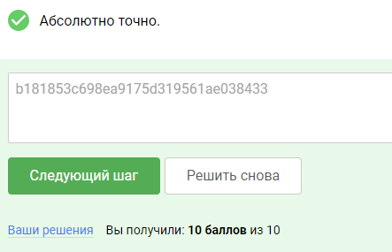

### Уязвимости разграничения доступа к каталогам

Манипуляция путем к каталогам (также известный как обход файловых путей, англ. Path Traversal или Directory Traversal) –
это уязвимость веб-безопасности, позволяющая злоумышленнику читать произвольные файлы на сервере, на котором запущено
приложение. Сюда могут входить код приложения и данные, учетные данные для внутренних систем и конфиденциальные файлы
операционной системы. В некоторых случаях злоумышленник может записать в произвольные файлы на сервере, что позволит ему
изменить данные или поведение приложения, и, в конечном счете, получить полный контроль над сервером.

Почему такие уязвимости появляются?
Уязвимости Directory Traversal появляются из-за отсутствия валидации входных данных пользователя, а также из-за
отсутствия разграничения доступа приложения или функции на возможность обращаться к файловым ресурсам всего сервера.

Пример уязвимого кода:

<?php
$template = 'red.php';
if (isset($_COOKIE['TEMPLATE'])) {
    $template = $_COOKIE['TEMPLATE'];
}
include "/home/users/phpguru/templates/" . $template;

В данном примере мы видим, что функция include подключает файлы из директории /home/users/phpguru/templates/ ,имена 
которых отправил пользователь в своих Cookie данных на сервер. В таком случае пользователь может изменить отправляемые 
им данные и добавить в данные отправляемые на сервер строку ../../../../../etc/passwd .  В таком случае, сервер выполнит
запрос к файлу по адресу /home/users/phpguru/templates/../../../../../etc/passwd , что в конечном итоге превратиться в
обращение к файлу /etc/passwd, и предоставит возможность чтения пользователю системных файлов ОС, к которым он не 
должен был иметь доступа.

#### Пример эксплуатации уязвимости
Чтение файлов при помощи Directory traversal

Рассмотрим торговое приложение, которое отображает изображения предметов для продажи. Изображения загружаются через некоторый HTML, как показано ниже:

URL loadImage принимает параметр имени файла и возвращает содержимое указанного файла. Сами файлы образов хранятся на диске в каталоге /var/www/images/. Чтобы вернуть образ, приложение добавляет запрашиваемое имя файла в этот базовый каталог и использует API файловой системы для чтения содержимого файла. В описанном выше случае приложение
читает по следующему пути к файлу: /var/www/images/218.png

Приложение не реализует защиту от атак обхода директорий, поэтому злоумышленник может запросить следующий URL для получения произвольного файла из файловой системы сервера:
https://insecure-website.com/loadImage?filename=../../../etc/passwd

Это приводит к тому, что приложение читает по следующему пути к файлу:
/var/www/images/../../../etc/passwd

Последовательность ../ действительна внутри пути к файлу и означает повышение на один уровень в структуре каталога. Три последовательных ../  идут вверх от /var/www/images/ до корня файловой системы, и, таким образом, до файла, который действительно читается: /etc/passwd

В операционных системах на базе Unix это стандартный файл, содержащий информацию о пользователях, зарегистрированных на сервере.

В Windows, как  ../, так и  ..\ являются действительными последовательностями обхода директорий, и эквивалентной атакой для получения стандартного файла операционной системы была бы атака:
https://insecure-website.com/loadImage?filename=..\..\..\windows\win.ini.

