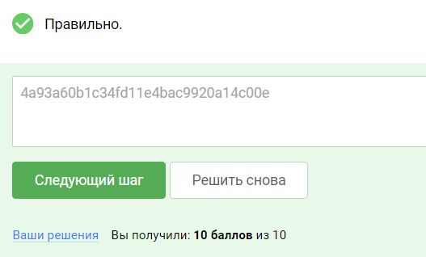

### 5.7 Уязвимости внедрения внешних сущностей XML

Что такое XML?

Расширяемый язык разметки (Extensible Markup Language, XML) позволяет определять и хранить данные совместно используемым
способом. XML поддерживает обмен информацией между компьютерными системами, такими, как веб-сайты, базы данных и
сторонние приложения. Предопределенные правила упрощают передачу данных в виде XML-файлов по любой сети, поскольку
получатель может использовать эти правила для точного и эффективного чтения данных.

Что это такое XXE инъекция?

Инъекция внешних сущностей XML (также известная как XML External Entity, XXE) – это уязвимость веб-безопасности,
позволяющая злоумышленнику вмешиваться в обработку XML-данных приложения. Часто она позволяет злоумышленнику
просматривать файлы на файловой системе сервера приложений, а также взаимодействовать с любыми внутренними или внешними
системами, к которым имеет доступ само приложение.

Почему такие уязвимости появляются?
Некоторые приложения используют формат XML для передачи данных между браузером и сервером. Приложения, которые делают
это, практически всегда используют стандартную библиотеку или платформенный API для обработки XML-данных на сервере.

Уязвимости XXE возникают из-за того, что спецификация XML содержит различные потенциально опасные функции, и стандартные
парсеры поддерживают эти функции, даже если они обычно не используются приложением.

### Узнаем о формате XML, DTD и внешних сущностях

Внешние сущности XML — это тип пользовательских сущностей XML, определенные значения которых загружаются вне DTD, в
котором они объявлены. Внешние сущности особенно интересны с точки зрения безопасности, так как они позволяют определить
сущность, основываясь на содержимом пути к файлу или URL.

#### Пример кода XML документа:

Пример инъекции внешних сущностей в XML документ:

К чему такие уязвимости могут привести?
Атаки инъекции XXE позволяют провести множество различных вариаций векторов атак, например:

- Использование XXE для получения файлов, где определяется внешняя сущность, содержащая содержимое файла, и возвращается
  в
  ответе приложения.
- Использование XXE для выполнения SSRF атак, где внешняя сущность определяется на основе URL на внутреннюю систему.
- Использование слепой инъекции XXE с отправкой данных за рамки клиент-серверного приложения, где конфиденциальные
  данные
  передаются с сервера приложения на систему, контролируемую злоумышленником.
- Использование слепого XXE для получения данных с помощью сообщений об ошибках, где злоумышленник может вызвать
  сообщение
  об ошибке разбора, содержащее конфиденциальные данные.
- Использование XXE для проведения атак отказа в обслуживании (англ. Distributed Denialof Service (DDoS)).

#### Примеры XXE

Для выполнения атаки XXE-инъекции, в результате которой произвольный файл извлекается из файловой системы сервера, вам
необходимо изменить представленный XML двумя способами:

Ввести или отредактировать элемент DOCTYPE, который определяет внешнюю сущность, содержащую путь к файлу.
Отредактировать значение данных в XML, которое возвращается в ответе приложения, чтобы использовать определенную внешнюю
сущность.
Например, предположим, что торговое приложение проверяет уровень запасов продукта, отправляя следующий XML на сервер:

Приложение не выполняет никакой специфической защиты от атак XXE, поэтому вы можете использовать уязвимость XXE для
получения файла /etc/passwd, отправив следующую полезную нагрузку XXE:Эта полезная нагрузка XXE определяет внешнюю
сущность &xxe, значение которой является содержимым файла /etc/passwd и использует сущность в пределах значения
productId. Это приводит к тому, что в ответ приложения включается содержимое файла:


самый быстрый способ ввести в админку запрс 
```commandline
apache2; cat /var/www/secret
```


