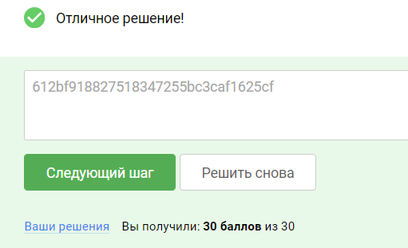

### 9.3 Практика

Подготовка
Требования к лабораторному стенду:

На вашей операционной системе должно быть установлено программное обеспечение docker и docker-compose.

Поддерживаемые ОС: Linux,Windows, MacOS (x64/arm).

Для подготовки стенда:

Необходимо скачать архив по ссылке: lpe.zip (Зеркало: lpe.zip Яндекс.Диск)

Распаковать данный архив и перейти в появившуюся директорию “lpe-prod” в терминальной оболочке вашей ОС. Выполнить
команду:

      docker-compose up -d

На вашей машине, где вы запустили докер контейнер, появится порт 2022. Вы можете подключиться к данному порту используя
протокол ssh и команду:

      ssh -p 2022 regular@127.0.0.1

Логин пользователя: regular
Пароль пользователя: regular

Возможные проблемы:

1. Если вы не отключили прошлые лабораторные стенды, может появиться ошибка:

         Bind for 0.0.0.0:2022 failed: port is already allocated

В таком случае, выполните команду docker ps, найдите запущенный контейнер, который использует занятый ранее порт, и
остановите его командой:

         docker stop [имя контейнера или его идентификатор]

2. Если ранее на своем же узле вы поднимали SSH сервисы, то цифровая подпись вашего нового сервиса может не совпадать со
   старой. В таком случае SSH клиент не даст вам подключиться к своему же сервису и выведет ошибку:

         @ WARNING: REMOTE HOST IDENTIFICATION HAS CHANGED!     @

Это значит, что в файле ~/.ssh/known_hosts осталась прежняя цифровая подпись для узла 127.0.0.1.

Чтобы исключить эту ошибку нужно зайти в файл  ~/.ssh/known_hosts и удалить записи связанные с IP адресом 127.0.0.1 из
файла.

Выглядеть данные строки могут так:

      [127.0.0.1]:2022 ecdsa-sha2-nistp256 AAAA………….……1cV6VE=

### Задание
Проанализируйте конфигурацию операционной системы от имени низко привилегированного пользователя regular зайдя в ОС при
помощи протокола SSH. Обнаружьте уязвимости конфигурации настроек sudo для вашего пользователя.

В качестве подтверждения успешной эксплуатации предоставьте флаг (секретную строку в формате 32 букв и цифр) из файла
root.txt расположенного в директории /root/.

